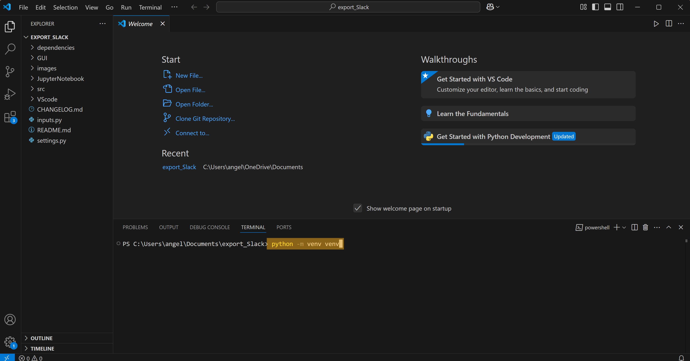
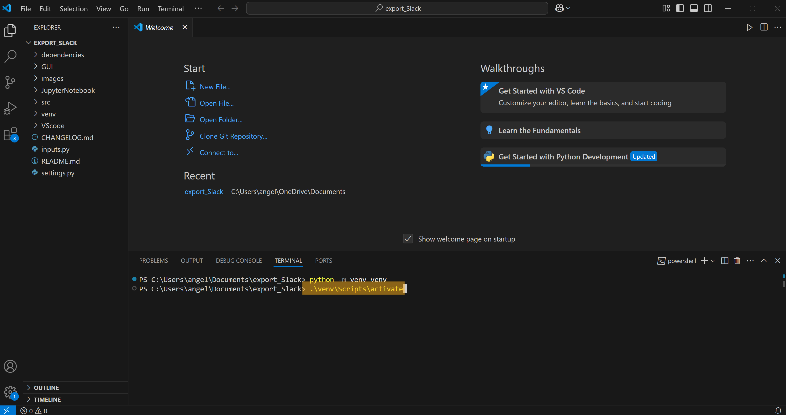

#### To download and open the source code in Visual Studio Code:
* [Visit the main page of the GitHub repository](https://github.com/angelicads93/export_Slack), click on the green button “<>code” and select the option “Download ZIP”.
* Unzip and save this folder in the directory of your choice.
* Open Visual Studio Code.
* Click on “File” > “Open Folder”. 
<p align="center">
  
</p>
  
* Navigate through your files and click on the folder “export_Slack” you just downloaded, then click “Select Folder”. You may need to give permission for the files to open. After the folder have been opened, you should see “EXPORT_SLACK” in the Explorer tab of your Visual Studio Code interface.
<p align="center">
  
  
</p>


* Open a terminal by clicking “Terminal” > “New Terminal”. 
<p align="center">
  
  
</p>
    
#### To create the virtual environment:
* Create a virtual environment by running in the Terminal you just opened,
  ```{script}
  python -m venv venv
  ```
  Use either "python" or "python3" depending on your Python installation. This should create a new folder called “venv” which you can see in the Explorer tab of your Visual Studio Code interface.
<p align="center">
  
</p>

* Activate the virtual environment you just created by running in the Terminal,
  ```{sript}
   .\venv\Scripts\activate
  ```
  You will see "(venv)" at the beginning of the line with the command prompt, indicating that the you are working on the activated virtual environment venv.
<p align='center'>
  
  
</p>

* Install the required dependencies in your virtual environment by running in the Terminal,
  ```{script}
   pip install -r .\dependencies\requirements.txt
  ```
   When everything has been installed, you should see in your Terminal a message that says “Successfully installed“ followed by the names of all the dependencies.
<p align="center">
  
  
</p>

#### To specify the conditions of the analysis:
* From your explorer tab, open the files `inputs.txt` and `settings_messages.txt`.
* Specify your choices. Among your inputs, you would need to indicate the absolute path to the directories where the source information is and the absolute path where you wish to save the output of this analysis. If you are working from Windows, you can obtain the absolute path of a directory by first using Windows File Explorer to navigate to the desired folder, right-click on it, select "Copy as path" and paste this absolute path into the corresponding entry of the `inputs.txt` file.
* Save the changes.

#### To run the analysis:
* From the terminal, change to the directory VScode with
```{script}
cd .\VScode\
```
<p align="center">
  
  
</p>

* To generate the Excel files from the Slack channels, run in your terminal
  ```{script}
  python .\extract_messages.py --inputs_file_path="..\inputs.txt" --settings_file_path="..\settings_messages.txt"
  ```
<p align="center">
  
  
</p>

* Once the Excel file(s) of the Slack channel(s) have been generated, you may compile the parsed weekly reports from all the channels in a new Excel file. First, specify your formatting choices in the file `settings_messages.txt`. Then, run in your terminal
  ```{script}
  python .\extract_weekly_reports.py --settings_file_path="..\settings_weekly_reports.txt"
  ```
* Furthermore, to generate an Excel file with a compilation of all the messages containing URL(s) in their text, first specify your formatting choices in the file `settings_urls.txt`, and then, run in your terminal
  ```{script}
  python .\extract_urls.py --settings_file_path="..\settings_urls.txt"
  ```

After you have finished using exportSlack, you can deactivate the virtual environment by running the following command in the terminal,
```{script}
deactivate
```
<p align="center">
  
  
</p>

