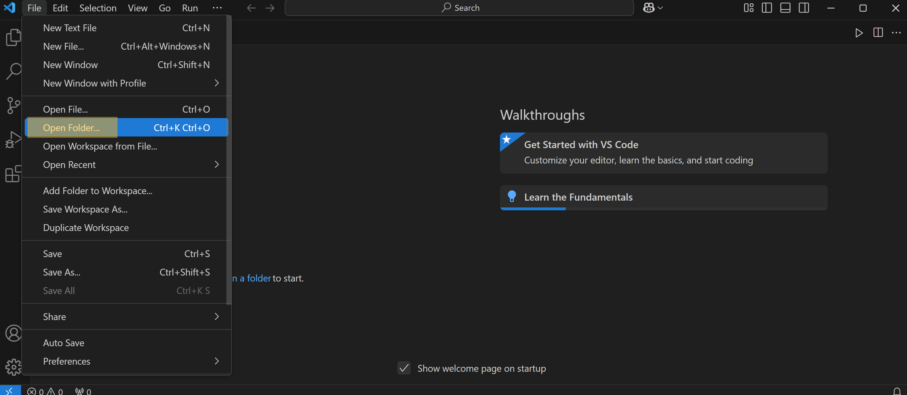
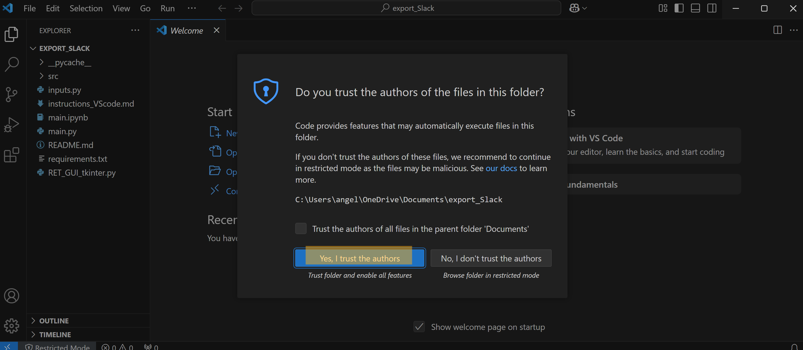
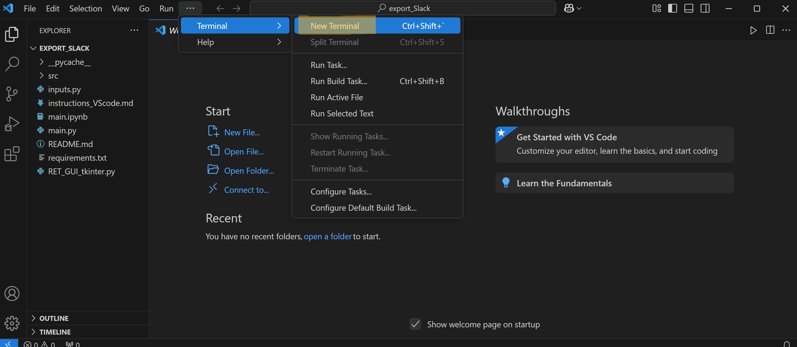
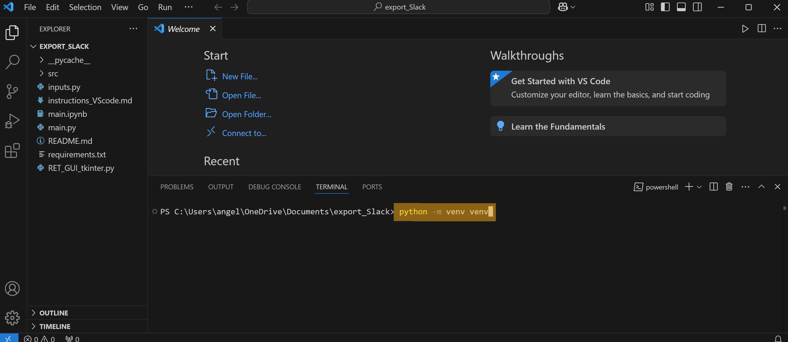
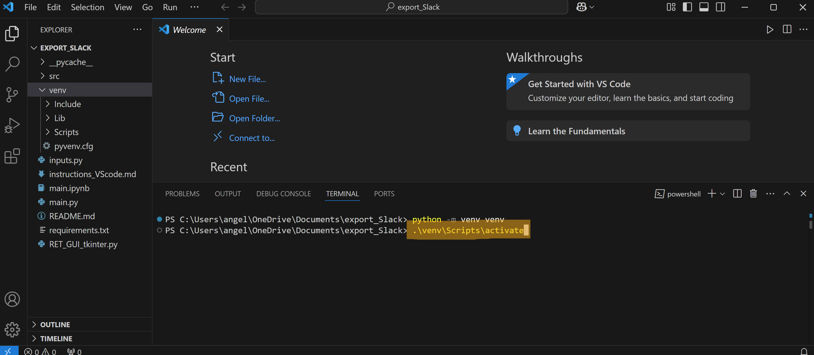
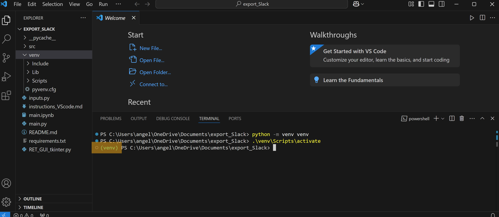
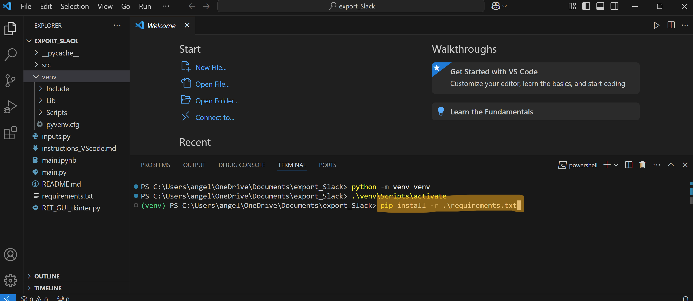
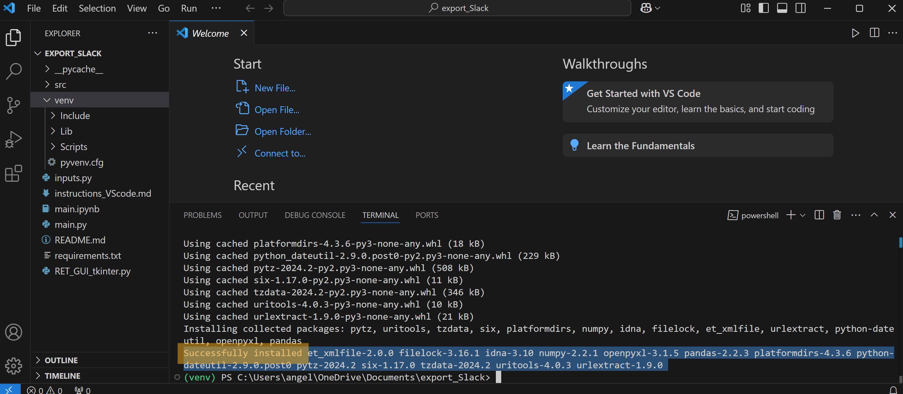
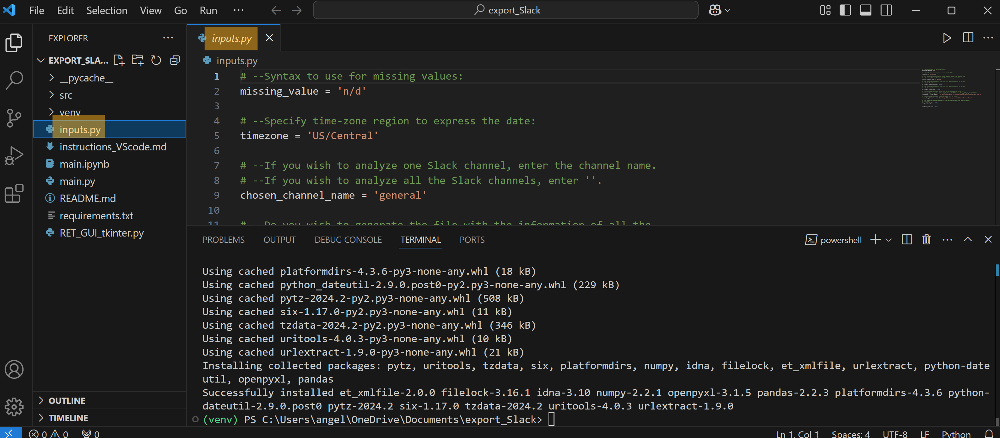
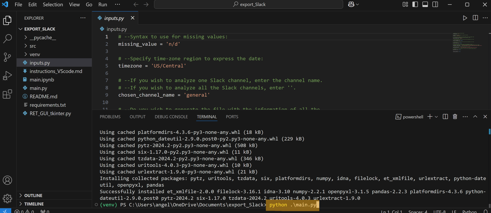

Here you can find the instructions to set up and use the code export_Slack from Visual Studio Code.

#### To download and open the source code in Visual Studio Code:
* Visit https://github.com/angelicads93/export_Slack, click on the green button “<>code” and select the option “Download ZIP”.
* Unzip and save this folder in the directory of your choice. You can rename the folder as “export_Slack”.
* Open Visual Studio Code.
* Click on “File” > “Open Folder”.
<p align="center">
  
  
</p>
  
* Navigate through your files and click on the folder “export_Slack” you just downloaded, then click “Select Folder”. You should see “EXPORT_SLACK” in the Explorer tab of your Visual Studio Code interface.
* You can now open a terminal by clicking “Terminal” > “New Terminal”. We'll need to run a couple of commands from this terminal; make sure your working directory is export_Slack for the rest of the steps.
<p align="center">
  
</p>
    
#### To create the virtual environment:
* Create a virtual environment by running in the Terminal you just opened,
  ```{script}
  python -m venv venv
  ```
  Use either "python" or "python3" depending on your Python installation. This should create a new folder called “venv” which you can see in the Explorer tab of your Visual Studio Code interface.
<p align="center">
  
</p>

* Activate the virtual environment you just created by running in the Terminal,
  ```{sript}
   .\venv\Scripts\activate
  ```
  You will see "(venv)" at the beginning of the line with the command prompt, indicating that the you are working on the activated virtual environment venv.
<p align='center'>
  
  
</p>

* Install the required dependencies in your virtual environment by running in the Terminal,
  ```{script}
   pip install -r requirements.txt
  ```
   When everything has been installed, you should see in your Terminal a message that says “Successfully installed“ followed by the names of all the dependencies.
<p align="center">
  
  
</p>

#### To specify the conditions of the analysis:
* From your explorer tab, open the file called “inputs.py”.
* Specify the conditions of your choice. Among your inputs, you would need to indicate the absolute path to the directories where the source information is and the absolute path where you wish to save the output of this analysis. If you are working from Windows, you can obtain the absolute path of a directory by first using Windows File Explorer to navigate to the desired folder, right-click on it, select "Copy as path" and paste this absolute path into the corresponding entry of the inputs.py file.
* Save the changes.
<p align="center">
  
</p>

#### To run the analysis:
* From the Terminal, and within the same virtual environment venv, run the command
  ```{script}
  python .\main.py
  ```
<p align="center">
  
</p>

After you have finished using exportSlack, you can deactivate the virtual environment by running the following command in your powershell:
```{script}
deactivate
```
<p align="center">
  
</p>

